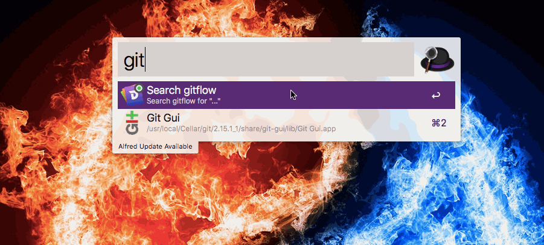
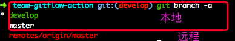
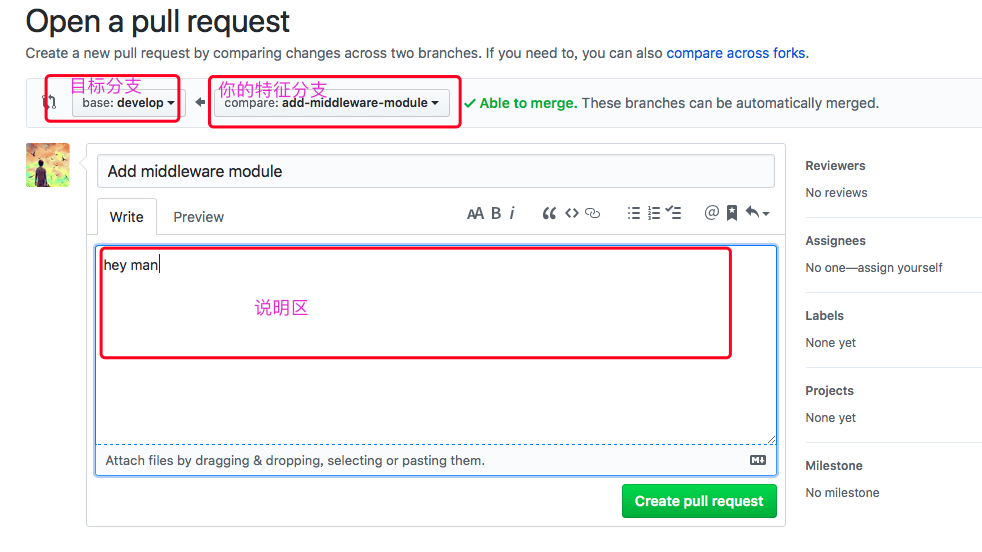
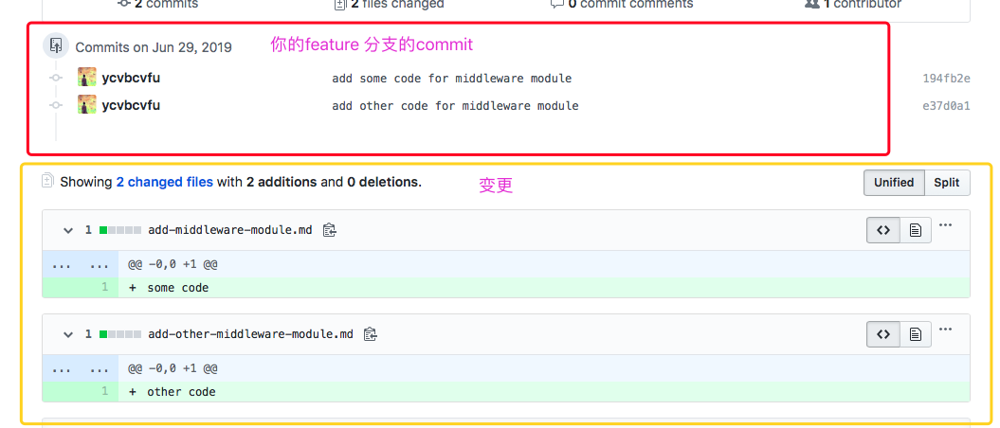
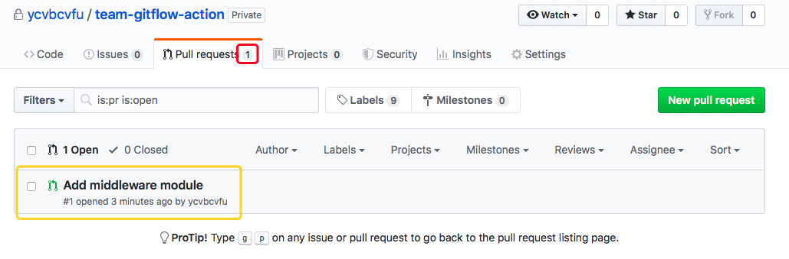
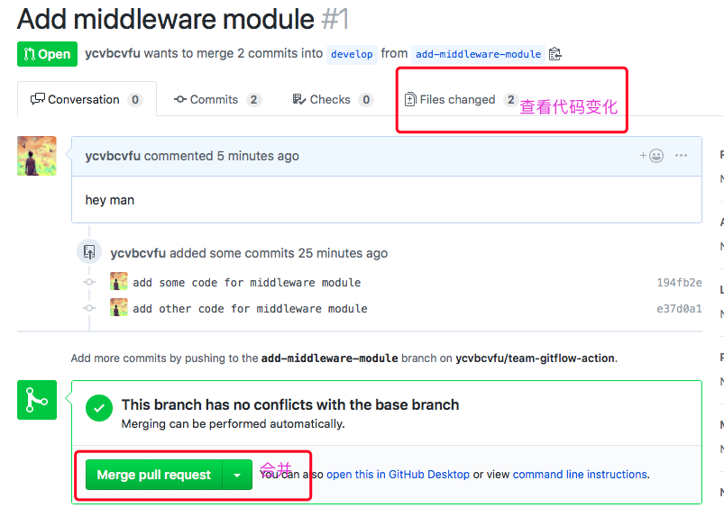
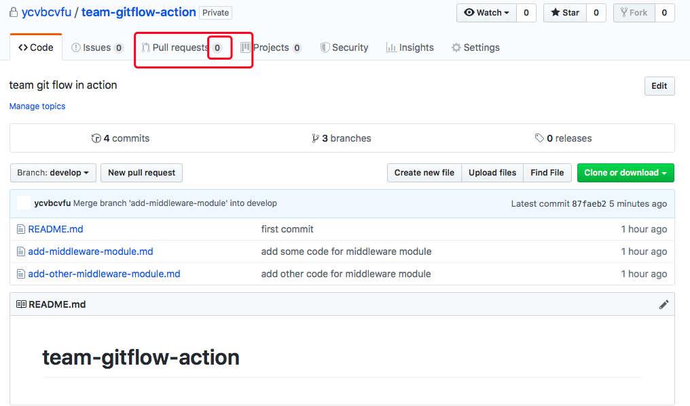
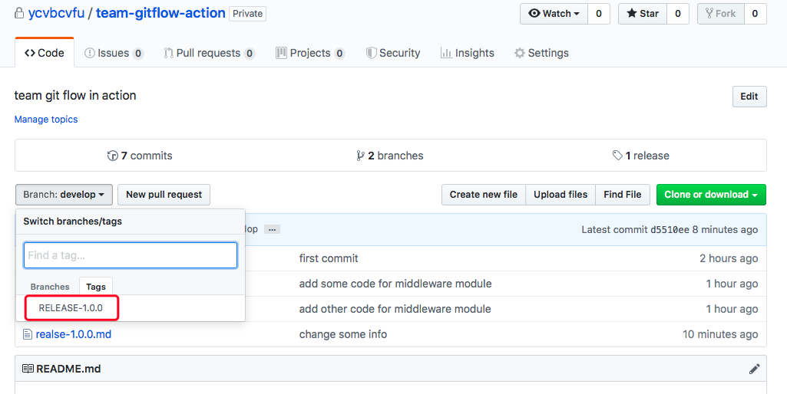
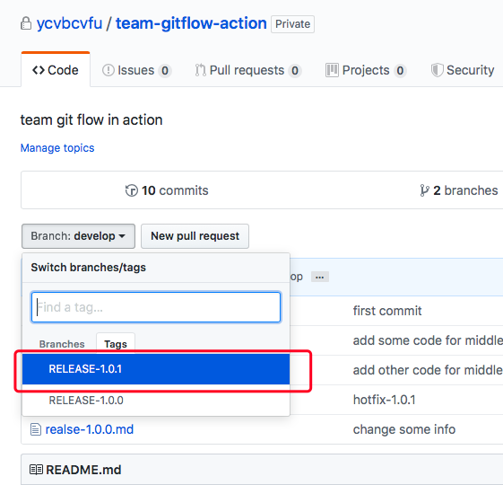

# team-gitflow-action





[Dash Docset Download Link](https://github.com/ycvbcvfu/team-gitflow-action/blob/master/docs/gitflow.docset.zip)

[Online CheatSheet](https://gitflow.ryanbing.com/)


### git flow 安装指引

`macOS Homebrew`

```yml
brew install git-flow-avh
```

`Linux`

```yml
apt-get install git-flow
```

`Windows (Cygwin)`

```yml
$ wget -q -O - --no-check-certificate https://raw.github.com/petervanderdoes/gitflow-avh/develop/contrib/gitflow-installer.sh install stable | bash
```

更多访问[gitflow-avh](https://github.com/petervanderdoes/gitflow-avh/wiki/Installation)

### 项目初始化

在github/gitlab上创建一个项目,之后拉取到本地,然后初始化程序

```yml
echo "# team-gitflow-action" >> README.md
git init
git add README.md
git commit -m "first commit"
git remote add origin https://github.com/ycvbcvfu/team-gitflow-action.git
git push -u origin master
```

`tips`: 当你有多个账号时候，最好设置局部账号,以避免某些不必要的麻烦

```
git config   user.name "name"
git config   user.email email@gmail.com
```


### git flow 流程

#### 1、git flow 初始化
任何一个项目想用`git flow` 方式,都必须执行 `git flow init -d`

```yml
➜  team-gitflow-action git:(master) git flow init -d
Using default branch names.

Which branch should be used for bringing forth production releases?
   - master
Branch name for production releases: [master]
Branch name for "next release" development: [develop]

How to name your supporting branch prefixes?
Feature branches? []
Bugfix branches? []
Release branches? []
Hotfix branches? []
Support branches? []
Version tag prefix? []
Hooks and filters directory? [/Users/xx/PycharmProjects/team-gitflow-action/.git/hooks]
```

`tips`: - d参数, 执行以下命令后，仓库中会自动生成开发流程所需的分支,执行`git branch -a`发现自动创建了`develop`分支,而且切换到了`develop`



此刻，本地有 develop 和 master 分支，运程只有master 分支.

你可以在不修改任何东西直接把 本地的`develop` push 到 `origin `这个远程，如下：

```yml
➜  team-gitflow-action git:(develop) git push -u origin develop
Total 0 (delta 0), reused 0 (delta 0)
remote:
remote: Create a pull request for 'develop' on GitHub by visiting:
remote:      https://github.com/ycvbcvfu/team-gitflow-action/pull/new/develop
remote:
To github.com:ycvbcvfu/team-gitflow-action.git
 * [new branch]      develop -> develop
Branch 'develop' set up to track remote branch 'develop' from 'origin'.
➜  team-gitflow-action git:(develop) git branch -a
* develop
  master
  remotes/origin/develop
  remotes/origin/master
```
运程多了一个`remotes/origin/develop` 分支,这个分支就是以后团队开发的最新代码，所有人员开发新的代码都是以此为基础.

`master 和 develop 分支的区别`：

> `*master分支*`是最稳定的发布版本，`开发者(developer)不允许对这个分支直接进行修改和提交`。只允许其他分支与master 分支进行合并,一般是在其他成品之后再合并到master分支

> `*develop分支*`是其他代码的基础，其他开发分支都是从这里出去，`开发者(developer)不允许对这个分支直接进行修改和提交`


#### 2、以develop为基础，开发feature分支

当我们接到需求的时候，开发写代码，一般走以下流程

1. (必要好习惯)同步远程的 `develop分支`:`切换devdevelop之后git pull`
2. 以`develop分支`为基础创建 `feature 分支`
3. `feature 分支` 实现目标功能
4. 将`feature 分支`push 到远程，并向`develop分支`发送 Pull Request
5. 接受`项目管理者Maintainers（Masters）`审查，合格之后`项目管理者Maintainers（Masters）`将 Pull Request 合并至 develop 分支
6. (可选)删除已经合并的特征分支

比如我们现在要对项目增加对`中间件的支持`:

```yml
➜  team-gitflow-action git:(develop) git flow feature start add-middleware-module
Switched to a new branch 'add-middleware-module'

Summary of actions:
- A new branch 'add-middleware-module' was created, based on 'develop'
- You are now on branch 'add-middleware-module'

Now, start committing on your feature. When done, use:

     git flow feature finish add-middleware-module

➜  team-gitflow-action git:(add-middleware-module) git branch -a
* add-middleware-module
  develop
  master
  remotes/origin/develop
  remotes/origin/master
```

`命令：git flow feature start <特征分支名字>`,它会自动的转换到对应的特征分支上，同时会提醒你完成这个模块之后使用  `命令：git flow feature finish <特征分支名字>` 来提交.
下面来展示一下大致的流程：

```yml
➜  team-gitflow-action git:(add-middleware-module) ls
README.md
➜  team-gitflow-action git:(add-middleware-module) echo "some code " > add-middleware-module.md
➜  team-gitflow-action git:(add-middleware-module) ✗ git add add-middleware-module.md
➜  team-gitflow-action git:(add-middleware-module) ✗ git commit -m "add some code for middleware module"
[add-middleware-module 194fb2e] add some code for middleware module
 1 file changed, 1 insertion(+)
 create mode 100644 add-middleware-module.md
➜  team-gitflow-action git:(add-middleware-module) echo "other code" > add-other-middleware-module.md
➜  team-gitflow-action git:(add-middleware-module) ✗ git add .
➜  team-gitflow-action git:(add-middleware-module) ✗ git commit -m "add other code for middleware module"
[add-middleware-module e37d0a1] add other code for middleware module
 1 file changed, 1 insertion(+)
 create mode 100644 add-other-middleware-module.md
➜  team-gitflow-action git:(add-middleware-module) git push origin add-middleware-module
Counting objects: 6, done.
Delta compression using up to 4 threads.
Compressing objects: 100% (4/4), done.
Writing objects: 100% (6/6), 541 bytes | 541.00 KiB/s, done.
Total 6 (delta 1), reused 0 (delta 0)
remote: Resolving deltas: 100% (1/1), done.
remote:
remote: Create a pull request for 'add-middleware-module' on GitHub by visiting:
remote:      https://github.com/ycvbcvfu/team-gitflow-action/pull/new/add-middleware-module
remote:
To github.com:ycvbcvfu/team-gitflow-action.git
 * [new branch]      add-middleware-module -> add-middleware-module
```
当你完成代码之后，会把你的这个分支`add-middleware-module` push 到 运程`origin`,同时在你的web 界面发起 `add-middleware-module 合并到develop分支的 Merge Requests请求`. 





不管是github 还是gitlab 默认合并分支的都是`master`. 需要管理着自己更改为`develop`作为默认的分支


`tip1`

```
当你开发特征分支的时候，不要最后合并请求的时候才来一个 git commit,应该每一小模块进行git commit.
```

`tip2`

```
gitlab: 可以在 `Settings` -> `General` -> `General project settings`来设置`Default Branch

github: 可以在 `Settings` -> `Branches` -> `Default branch` 来设置`Default Branch
```

接下来项目管理就可以发现有新的合并请求





项目者在看到合并请求之后要对代码进行review，然后才进行合并,有下面情况应该选择不合并

```
0. 格式编码出现问题(特别团队有win和mac一起开发时)
1. 没有测试或者测试不通过
2. 代码没有按照项目规范来(接口规范,命名, 注释等)
3. 代码质量低,代码冗余，有重构的余地
4. 不符合下个发布版本开发进度(延迟合并)
```

(`推荐`)同时项目管理者也可以进行本地命令的方式，对本次合并请求进行合并到`develop`

##### 本地合并操作

`Step 1. Fetch and check out the branch for this merge request`

```
git fetch origin
git checkout -b add-middleware-module origin/add-middleware-module
```
`Step 2. Review the changes locally`

`Step 3. Merge the branch and fix any conflicts that come up`

```
git checkout develop
git merge --no-ff add-middleware-module
```
`Step 4. Push the result of the merge to Github/GitLab`

实操如下：


```yml
➜  team-gitflow-action git:(develop) git fetch origin
➜  team-gitflow-action git:(develop) git checkout -b add-middleware-module origin/add-middleware-module
Branch 'add-middleware-module' set up to track remote branch 'add-middleware-module' from 'origin'.
Switched to a new branch 'add-middleware-module'
➜  team-gitflow-action git:(add-middleware-module) ls
README.md                      add-middleware-module.md       add-other-middleware-module.md
➜  team-gitflow-action git:(add-middleware-module) cat add-middleware-module.md  # review code
some code
➜  team-gitflow-action git:(add-middleware-module) git checkout develop
Switched to branch 'develop'
Your branch is up to date with 'origin/develop'.
➜  team-gitflow-action git:(develop) git merge --no-ff add-middleware-module  # fix any conflicts
Merge made by the 'recursive' strategy.
 add-middleware-module.md       | 1 +
 add-other-middleware-module.md | 1 +
 2 files changed, 2 insertions(+)
 create mode 100644 add-middleware-module.md
 create mode 100644 add-other-middleware-module.md
➜  team-gitflow-action git:(develop) git push origin develop
Counting objects: 1, done.
Writing objects: 100% (1/1), 237 bytes | 237.00 KiB/s, done.
Total 1 (delta 0), reused 0 (delta 0)
To github.com:ycvbcvfu/team-gitflow-action.git
   f0bc15f..87faeb2  develop -> develop
➜  team-gitflow-action git:(develop) ls
README.md                      add-middleware-module.md       add-other-middleware-module.md
```


其他人在`git pull` 的时候就会得到同步develop 分支已经合并的代码，如下：

```yml
➜  team-gitflow-action git:(develop) ls
README.md
➜  team-gitflow-action git:(develop) git pull
remote: Enumerating objects: 1, done.
remote: Counting objects: 100% (1/1), done.
remote: Total 1 (delta 0), reused 1 (delta 0), pack-reused 0
Unpacking objects: 100% (1/1), done.
From github.com:ycvbcvfu/team-gitflow-action
   f0bc15f..87faeb2  develop    -> origin/develop
Updating f0bc15f..87faeb2
Fast-forward
 add-middleware-module.md       | 1 +
 add-other-middleware-module.md | 1 +
 2 files changed, 2 insertions(+)
 create mode 100644 add-middleware-module.md
 create mode 100644 add-other-middleware-module.md
➜  team-gitflow-action git:(develop) ls
README.md                      add-middleware-module.md       add-other-middleware-module.md
```
`tips`: 每当需要开新的特征分支的时候，对develop 分支进行git pull同步代码是非常重要的事情.

当你百分百确定这个特征分支已经开发完毕，那么就可以执行git flow feature finish add-middleware-module,那么它会删除本地add-middleware-module和运程add-middleware-module,如下：

```yml
➜  team-gitflow-action git:(add-middleware-module) git branch -a
* add-middleware-module
  develop
  master
  remotes/origin/add-middleware-module
  remotes/origin/develop
  remotes/origin/master
➜  team-gitflow-action git:(add-middleware-module) git flow feature finish add-middleware-module
Switched to branch 'develop'
Your branch is up to date with 'origin/develop'.
Already up to date.
To github.com:ycvbcvfu/team-gitflow-action.git
 - [deleted]         add-middleware-module
Deleted branch add-middleware-module (was e37d0a1).

Summary of actions:
- The feature branch 'add-middleware-module' was merged into 'develop'
- Feature branch 'add-middleware-module' has been locally deleted; it has been remotely deleted from 'origin'
- You are now on branch 'develop'

➜  team-gitflow-action git:(develop) git branch -a
* develop
  master
  remotes/origin/develop
  remotes/origin/master
```


#### 3、以develop为基础，进行release的发布

当我们对一定的特征分支都完成之后就要开始考虑对现有功能进行发布，release 分支就是来做这么一个工作，它有一个特点：`release 分支只做BUG修复，不做其他支持`

一般流程如下：
1. git flow release start 'RELEASE-1.0.0'
2. 可以做一些其他的改变(发布参数或者其他)，git add/commit
3. git flow release finish 'RELEASE-1.0.0'
4. push 代码

之后会叫你提交三个commit

`发布版本合并到master的Commit `

```yml
1 Merge branch 'RELEASE-1.0.0'
2
3 # Please enter a commit message to explain why this merge is necessary,
4 # especially if it merges an updated upstream into a topic branch.
5 #
6 # Lines starting with '#' will be ignored, and an empty message aborts
7 # the commit.
```

`标签`

```yml
1 1.0.0
2 #
3 # Write a message for tag:
4 #   RELEASE-1.0.0
5 # Lines starting with '#' will be ignored.
```

`发布版本合并到develop的Commit `

```yml
1 Merge tag 'RELEASE-1.0.0' into develop
2
3 1.0.0
4
5 # Please enter a commit message to explain why this merge is necessary,
6 # especially if it merges an updated upstream into a topic branch.
7 #
8 # Lines starting with '#' will be ignored, and an empty message aborts
9 # the commit.
```


实操如下:

```yml
➜  team-gitflow-action git:(develop) git flow release start 'RELEASE-1.0.0'
Fatal: Prefix parameter missing.
Switched to a new branch 'RELEASE-1.0.0'
  1 Merge branch 'RELEASE-1.0.0'

Summary of actions:
- A new branch 'RELEASE-1.0.0' was created, based on 'develop'
- You are now on branch 'RELEASE-1.0.0'

Follow-up actions:
- Bump the version number now!
- Start committing last-minute fixes in preparing your release
- When done, run:

     git flow release finish 'RELEASE-1.0.0'
  1 1.0.0

➜  team-gitflow-action git:(RELEASE-1.0.0) ls
README.md                      add-middleware-module.md       add-other-middleware-module.md
➜  team-gitflow-action git:(RELEASE-1.0.0) echo "change some information " > realse-1.0.0.md
  1 Merge tag 'RELEASE-1.0.0' into develop
➜  team-gitflow-action git:(RELEASE-1.0.0) ✗ git add .
➜  team-gitflow-action git:(RELEASE-1.0.0) ✗ git commit -m "change some info"
[RELEASE-1.0.0 ec8bbd1] change some info
 1 file changed, 1 insertion(+)
 create mode 100644 realse-1.0.0.md
➜  team-gitflow-action git:(RELEASE-1.0.0) git flow release finish 'RELEASE-1.0.0'
Switched to branch 'master'
Your branch is up to date with 'origin/master'.
Merge made by the 'recursive' strategy.
 add-middleware-module.md       | 1 +
 add-other-middleware-module.md | 1 +
 realse-1.0.0.md                | 1 +
 3 files changed, 3 insertions(+)
 create mode 100644 add-middleware-module.md
 create mode 100644 add-other-middleware-module.md
 create mode 100644 realse-1.0.0.md
Already on 'master'
Your branch is ahead of 'origin/master' by 5 commits.
  (use "git push" to publish your local commits)
Switched to branch 'develop'
Your branch is up to date with 'origin/develop'.
warning: refname 'RELEASE-1.0.0' is ambiguous.
warning: refname 'RELEASE-1.0.0' is ambiguous.
Merge made by the 'recursive' strategy.
 realse-1.0.0.md | 1 +
 1 file changed, 1 insertion(+)
 create mode 100644 realse-1.0.0.md
Deleted branch RELEASE-1.0.0 (was ec8bbd1).

Summary of actions:
- Release branch 'RELEASE-1.0.0' has been merged into 'master'
- The release was tagged 'RELEASE-1.0.0'
- Release tag 'RELEASE-1.0.0' has been back-merged into 'develop'
- Release branch 'RELEASE-1.0.0' has been merged into 'develop'
- Release branch 'RELEASE-1.0.0' has been locally deleted
- You are now on branch 'develop'
```

此刻你可以用`git branch -a `和 `git tag -l `来查看分支和tag 的信息.然后分别到 develop和master分支下执行git push或者如下分开来执行：

```yml
git push origin develop
git checkout master
git push origin master
git push --tags
```
实操如下：

```yml
➜  team-gitflow-action git:(develop) git push origin develop
Counting objects: 5, done.
Delta compression using up to 4 threads.
Compressing objects: 100% (4/4), done.
Writing objects: 100% (5/5), 602 bytes | 602.00 KiB/s, done.
Total 5 (delta 2), reused 0 (delta 0)
remote: Resolving deltas: 100% (2/2), completed with 1 local object.
To github.com:ycvbcvfu/team-gitflow-action.git
   87faeb2..d5510ee  develop -> develop
➜  team-gitflow-action git:(develop) git checkout master
Switched to branch 'master'
Your branch is ahead of 'origin/master' by 5 commits.
  (use "git push" to publish your local commits)
➜  team-gitflow-action git:(master) git push origin master
Total 0 (delta 0), reused 0 (delta 0)
To github.com:ycvbcvfu/team-gitflow-action.git
   f0bc15f..4b09486  master -> master
➜  team-gitflow-action git:(master) git push --tags
Counting objects: 1, done.
Writing objects: 100% (1/1), 160 bytes | 160.00 KiB/s, done.
Total 1 (delta 0), reused 0 (delta 0)
To github.com:ycvbcvfu/team-gitflow-action.git
 * [new tag]         RELEASE-1.0.0 -> RELEASE-1.0.0
```



你会发现只是多了`RELEASE-1.0.0` tag, 同时`RELEASE-1.0.0` , `develop`, `master`这者的代码都是一样的。

`tips`

```
生产下进行自动化部署的时候，都是以tag作为触发hook
```

#### 4、以master为基础，进行hotfix 分支BUG修复

`hotfix 分支` 是当生产发布版本出现BUG的时候，需要及时处理BUG而开辟的紧急修复分支. 所以hotfix 分支是` master 分支`或者`finish release时填写的版本标签号`作为起点。

现在假设另外一个项目管理者发现了这个BUG，对其进行紧急修复,修复流程:

1. git clone 代码
2. git flow init -d
3. git flow hotfix start '1.0.1' master
4. 修复问题
5. git flow hotfix finish '1.0.1'
6. push 代码

下面是实操代码：

```yml
➜  team-gitflow-action git:(develop) git flow hotfix start 'RELEASE-1.0.1' master
Fatal: Prefix parameter missing.
Switched to a new branch 'RELEASE-1.0.1'
  1 Merge branch 'RELEASE-1.0.1'

Summary of actions:
- A new branch 'RELEASE-1.0.1' was created, based on 'master'
- You are now on branch 'RELEASE-1.0.1'
  1 1.0.1

Follow-up actions:
- Start committing your hot fixes
- Bump the version number now!
  1 Merge tag 'RELEASE-1.0.1' into develop
- When done, run:

     git flow hotfix finish 'RELEASE-1.0.1'

➜  team-gitflow-action git:(RELEASE-1.0.1) ls
README.md                      add-middleware-module.md       add-other-middleware-module.md realse-1.0.0.md
➜  team-gitflow-action git:(RELEASE-1.0.1) echo "RELEASE-1.0.1" > hotfix-1.0.3.md
➜  team-gitflow-action git:(RELEASE-1.0.1) ✗ git add .
➜  team-gitflow-action git:(RELEASE-1.0.1) ✗ git commit -m "hotfix-1.0.1"
[RELEASE-1.0.1 be5a289] hotfix-1.0.1
 1 file changed, 1 insertion(+)
 create mode 100644 hotfix-1.0.3.md
➜  team-gitflow-action git:(RELEASE-1.0.1) git flow hotfix finish 'RELEASE-1.0.1'
Switched to branch 'master'
Your branch is up to date with 'origin/master'.
Merge made by the 'recursive' strategy.
 hotfix-1.0.3.md | 1 +
 1 file changed, 1 insertion(+)
 create mode 100644 hotfix-1.0.3.md
Switched to branch 'develop'
Your branch is up to date with 'origin/develop'.
warning: refname 'RELEASE-1.0.1' is ambiguous.
warning: refname 'RELEASE-1.0.1' is ambiguous.
Merge made by the 'recursive' strategy.
 hotfix-1.0.3.md | 1 +
 1 file changed, 1 insertion(+)
 create mode 100644 hotfix-1.0.3.md
Deleted branch RELEASE-1.0.1 (was be5a289).

Summary of actions:
- Hotfix branch 'RELEASE-1.0.1' has been merged into 'master'
- The hotfix was tagged 'RELEASE-1.0.1'
- Hotfix tag 'RELEASE-1.0.1' has been back-merged into 'develop'
- Hotfix branch 'RELEASE-1.0.1' has been merged into 'develop'
- Hotfix branch 'RELEASE-1.0.1' has been locally deleted
- You are now on branch 'develop'

➜  team-gitflow-action git:(develop)
```

然后吧本地代码push 到远程

```
git push origin develop
git checkout master
git push origin master
git push --tags
```

下面是实操代码：

```yml
➜  team-gitflow-action git:(develop) git push origin develop
Counting objects: 5, done.
Delta compression using up to 4 threads.
Compressing objects: 100% (4/4), done.
Writing objects: 100% (5/5), 584 bytes | 292.00 KiB/s, done.
Total 5 (delta 2), reused 0 (delta 0)
remote: Resolving deltas: 100% (2/2), completed with 1 local object.
To github.com:ycvbcvfu/team-gitflow-action.git
   d5510ee..68c227f  develop -> develop
➜  team-gitflow-action git:(develop) git checkout master
Switched to branch 'master'
Your branch is ahead of 'origin/master' by 2 commits.
  (use "git push" to publish your local commits)
➜  team-gitflow-action git:(master) git push origin master
Total 0 (delta 0), reused 0 (delta 0)
To github.com:ycvbcvfu/team-gitflow-action.git
   4b09486..7aef997  master -> master
➜  team-gitflow-action git:(master) git push --tags
Counting objects: 1, done.
Writing objects: 100% (1/1), 160 bytes | 160.00 KiB/s, done.
Total 1 (delta 0), reused 0 (delta 0)
To github.com:ycvbcvfu/team-gitflow-action.git
 * [new tag]         RELEASE-1.0.1 -> RELEASE-1.0.1
```


